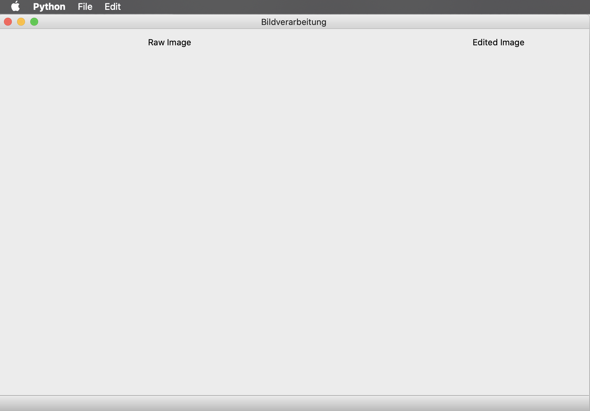
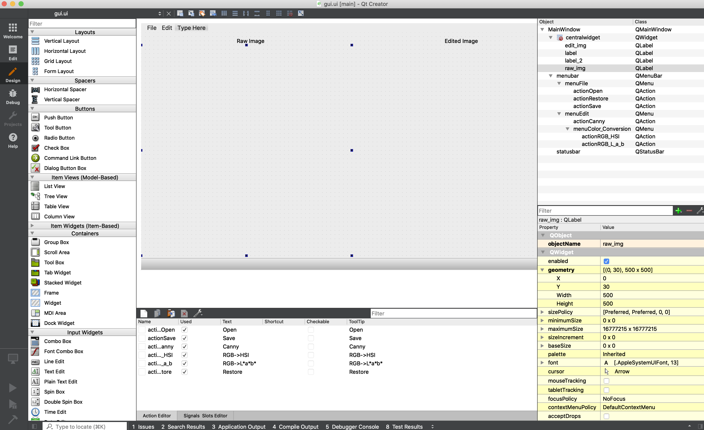

# Bildverarbeitung

This repository follows Bildverarbeitung FS2022 for Geomatik bachelor students at ETH Zurich. Lectures and recordings can be found in [Moodle](https://moodle-app2.let.ethz.ch/course/view.php?id=17253&lang=en). 

## Contact
If you have any questions, please let us know:
- Nadine Rueegg {nadine.rueegg@geod.baug.ethz.ch}
- Shengyu Huang {shengyu.huang@geod.baug.ethz.ch}
- Binbin Xiang {binbin.xiang@geod.baug.ethz.ch}

## Dependencies
This code has been test on 
- Python 3.7 and Python 3.8, MacOS and Linux

As the first step, please git clone this repository to your local machine by running:
```
git clone https://github.com/prs-eth/Bildverarbeitung-FS2022.git
``` 

Then, please run the following commands to create virtual environment and install dependencies: 
```
virtualenv vildverarbeitung
source vildverarbeitung/bin/activate
pip install numpy PyQt5 opencv_python scikit-image
```

Next, please install QT Designer
- For windows and Linux user, you can install by running:
```
pip install PyQt5_tools
```
- For MacOS user, please choose ```5.12.x Offline Installers``` and install from [here](https://www.qt.io/offline-installers)

Now you can open the GUI by running:
```
python main.py
```
and you will see sth like:



### Known issues
If you run into errors like 
```
QObject::moveToThread: Current thread (0x2ab1aa0) is not the object's thread (0x312d4d0).
Cannot move to target thread (0x2ab1aa0)

qt.qpa.plugin: Could not load the Qt platform plugin "xcb" in "/scratch2/shengyu/predator/lib/python3.8/site-packages/cv2/qt/plugins" even though it was found.
This application failed to start because no Qt platform plugin could be initialized. Reinstalling the application may fix this problem.

Available platform plugins are: xcb, eglfs, linuxfb, minimal, minimalegl, offscreen, vnc, wayland-egl, wayland, wayland-xcomposite-egl, wayland-xcomposite-glx, webgl.

Aborted
```

Please uninstall ```opencv_python``` and instead ```opencv_python_headless``` instead:
```
pip uninstall opencv_python
pip install opencv_python_headless
```

## Instructions
This GUI is built on QT, to make any modifications, please first open qt designer/creator:
- For linux and windows user, please run:
```
pyqt5-tools designer
```
- For MacOS user, please just open QT Creator after installation.

Then please open assets/gui.ui and make modifications. 



Afterwards, you can first save the modifications and run
```
pyuic5 -o libs/gui.py assets/gui.ui
```
to update associated python files. You will see the new GUI by running 
```
python main.py
```
